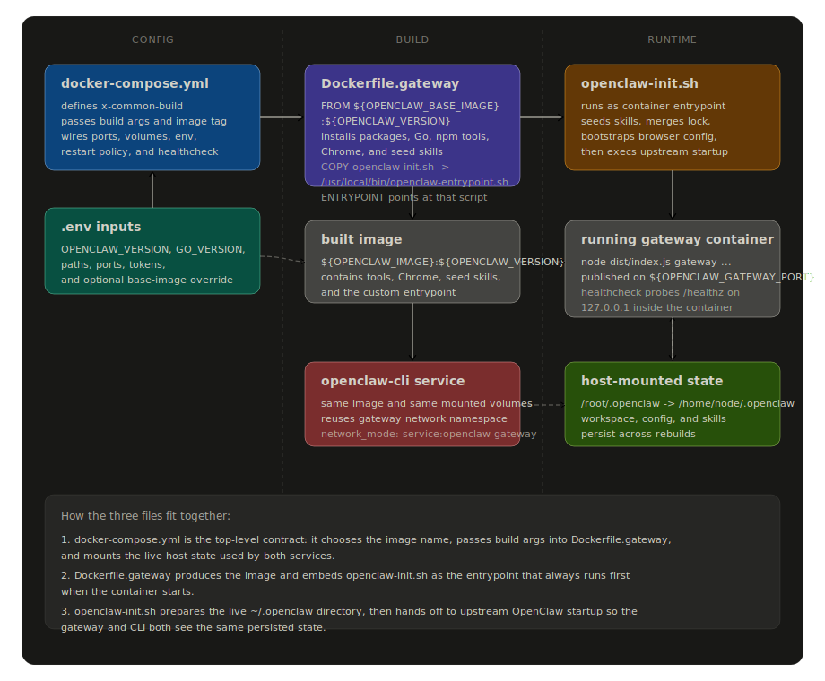

# openclaw-setup — Personal OpenClaw Gateway

This repository is a **production-ready personal setup** for running [OpenClaw](https://openclaw.ai/) as a self-hosted AI gateway inside Docker. It extends the official OpenClaw image with extra IT-admin tools, a Go toolchain, pre-seeded skills, and a clean Compose workflow — so your gateway is reproducible, self-documenting, and ready to use out of the box.

> **New to OpenClaw?** → [OpenClaw docs](https://docs.openclaw.ai/) · [Getting started](https://docs.openclaw.ai/start/getting-started) · [Docker guide](https://docs.openclaw.ai/install/docker) · [GitHub repo](https://github.com/openclaw/openclaw)

---

## What is OpenClaw?

OpenClaw is a personal AI assistant you run on your own infrastructure. It connects to AI providers (OpenAI, Gemini, Anthropic, …) and delivers responses on the channels you already use — Telegram, Discord, WhatsApp, Slack, iMessage, and many more. The Gateway is the always-on control plane that keeps everything running.

This repository gives you a Dockerized gateway setup with extras baked in at image build time, so every container start is identical with no manual configuration inside the container.

---

## What this repo adds on top of the official image

| Added layer | What it provides |
|---|---|
| System packages (step 1) | Full IT-admin toolkit: networking (`nmap`, `iperf3`, `socat`, …), monitoring (`htop`, `glances`, `sysstat`, …), storage, TLS/PKI tools, `gh` CLI, Google Chrome |
| Go toolchain (step 2) | Go compiler at `/usr/local/go` + `go install` support |
| `openclaw-init.sh` (step 3) | Container entrypoint that seeds skills and merges the clawhub registry before starting the gateway |
| User switch (step 4) | Switch from `root` to `node` user (uid 1000) for all subsequent build steps — improving security |
| Go environment (step 5) | Set `GOPATH`, `PATH`, and other Go-related env vars for the `node` user |
| Go tools (step 6) | `qcard` — a CardDAV CLI address book application; useful for contact management and email client integration (see [qcard docs](https://pkg.go.dev/ser1.net/qcard)) |
| Node.js tools (step 7) | `clawhub`, `xurl`, `summarize`, `qmd` installed under `/home/node/.local` |
| Seed skills (step 8) | `github`, `browser-use`, `agent-browser-clawdbot` baked into the image and auto-installed on first start |
| HEALTHCHECK | Built-in Docker healthcheck polling `/healthz` |
| OCI labels | `org.opencontainers.image.title` + `version` for `docker inspect` and image scanners |

**Golden rule**: everything listed above is configured at Docker **build time**. Running `apt-get`, `npm install -g`, `clawhub install`, or `python -m pip install` inside a running container is an anti-pattern here — it will be lost on restart.

---

## Prerequisites

- Docker Engine (or Docker Desktop) + Docker Compose v2
- At least **15 GB** free disk space (the extended image is ~2.5 GB larger than the official base)
- A `.env` file copied from `.env.example` and filled with your secrets

---

## Quick start

```bash
# 1. Clone this repo
git clone https://github.com/henningsieh/openclaw-setup.git /root/openclaw
cd /root/openclaw

# 2. Copy the env template and fill in your secrets
cp .env.example .env
$EDITOR .env    # set OPENCLAW_GATEWAY_TOKEN, API keys, etc.

# 3. Build the gateway image (first build takes ~5-10 min)
docker compose build openclaw-gateway

# 4. Start the gateway
docker compose up -d openclaw-gateway

# 5. Wait ~20s, then check health
curl http://localhost:18789/healthz
# → {"ok":true,"status":"live"}

# 6. Open the Control UI
open http://localhost:18789
```

The gateway runs as user `node` (uid 1000). All persistent state lives on the host at `OPENCLAW_CONFIG_DIR` (default: `/root/.openclaw`) and survives container rebuilds.

---

## Repository layout

```
/root/openclaw/          ← this repository
  Dockerfile.gateway     ← extends the official image with extra tools + skills
  docker-compose.yml     ← gateway + CLI services
  openclaw-init.sh       ← container entrypoint: seeds skills, then starts gateway
  .env.example           ← template — copy to .env and fill in secrets
  .env                   ← your local secrets (gitignored, never commit)
  AGENTS.md              ← machine-oriented guide for AI agents
  CLAUDE.md              ← same as AGENTS.md (Claude-specific symlink)
  GEMINI.md              ← same as AGENTS.md (Gemini-specific symlink)

/root/openclaw-src/      ← upstream source clone (only needed for PR builds)
```

Images live only in the **local Docker image store** — they are never pushed to a registry. Run `docker images | grep openclaw` to list them.

---

## File map

| File | Role |
|---|---|
| `Dockerfile.gateway` | Eight-step build: system packages → Go → entrypoint → tools → skills |
| `openclaw-init.sh` | Entrypoint: seeds skills into host volume, merges clawhub registry, starts gateway |
| `docker-compose.yml` | Two services: `openclaw-gateway` (long-lived) + `openclaw-cli` (profile: `cli`) |
| `.env` | Your secrets and path overrides — **gitignored, never commit** |
| `.env.example` | Template with all keys documented — commit-safe |
| `AGENTS.md` | Machine-oriented guide for AI agents working in this repo |

---

## How These Files Work Together

The build and runtime flow is controlled by three files working as a chain:

- `docker-compose.yml` is the top-level orchestrator. It chooses the image name, passes build arguments into the Docker build, mounts the persistent host directories, publishes the gateway port, and defines both the long-lived gateway service and the one-shot CLI sidecar.
- `Dockerfile.gateway` turns those build arguments into an actual image. It installs system packages, Go, npm tools, Chrome, and seed skills, then copies `openclaw-init.sh` into the image and makes it the container entrypoint.
- `openclaw-init.sh` is the first code that runs when the container starts. It seeds and merges the live `~/.openclaw` directory, bootstraps browser defaults, persists `gh` auth, and only then hands off to the upstream OpenClaw startup path.

<!-- Build flow diagram: compose -> Dockerfile -> entrypoint -> runtime -->


This is the control flow in one sentence: `docker compose` reads `.env`, builds `Dockerfile.gateway`, that image bakes in `openclaw-init.sh`, and the running container uses that entrypoint to prepare the mounted host state before starting the gateway.

---

## Skills

OpenClaw skills are prompt/tool bundles installed under `~/.openclaw/skills/`. This repo uses a **seed approach**: skills are baked into the image at build time and automatically copied into your host volume on first container start. Your own skills installed at runtime are never overwritten.

### How the skill seed works

<!-- Skills flow diagram: build time vs runtime vs host volume -->


**Build time** (Dockerfile step 8):

```dockerfile
RUN CLAWHUB_WORKDIR=/opt/openclaw-skills-seed \
    clawhub install github browser-use agent-browser-clawdbot --no-input --force
```

This writes skill files + `lock.json` into `/opt/openclaw-skills-seed/` as a read-only image layer.

**Container start** (`openclaw-init.sh` runs before the gateway process):

1. `cp -rn /opt/openclaw-skills-seed/. /home/node/.openclaw/` — copies seed into the host volume. `-n` = no-clobber: your existing skills are never overwritten.
2. `jq -s '{version:1,skills:((.[0].skills//{})*((.[1].skills)//{}))}'` — merges the seed `lock.json` into the live `lock.json` so `clawhub list` tracks seed skills as properly installed (not "Manually installed"). The live lock wins on key collision.

**Key insight**: OpenClaw scans `~/.openclaw/skills/` automatically at startup — clawhub's `lock.json` only affects `clawhub list` output, not skill loading. If your host volume already has the skills, the seed mechanism is operationally redundant for day-to-day use.

### Seeded skills

| Skill | Purpose |
|---|---|
| `github` | GitHub integration — search issues, create PRs, review code |
| `browser-use` | Browser automation via Python agent |
| `agent-browser-clawdbot` | ClawdBot browser agent |

### Adding more seed skills

Edit `Dockerfile.gateway` step 8:

```dockerfile
RUN CLAWHUB_WORKDIR=/opt/openclaw-skills-seed \
    clawhub install github browser-use agent-browser-clawdbot my-new-skill \
    --no-input --force
```

Then rebuild:

```bash
docker compose build openclaw-gateway
docker compose up -d openclaw-gateway
```

### Installing skills at runtime (non-permanent)

```bash
docker exec openclaw-openclaw-gateway-1 clawhub install <slug>
```

This writes to the host volume (`/root/.openclaw/skills/`). The skill persists across restarts but is **not** part of the image — it will be lost if the volume is wiped. To make it permanent, add it to step 8 and rebuild.

### Verify installed skills

```bash
docker exec openclaw-openclaw-gateway-1 clawhub list
# github                    1.0.0
# browser-use               2.0.1
# agent-browser-clawdbot    0.1.0
```

---

## Configuration — `.env` reference

Copy `.env.example` to `.env` and fill in your values. The file is gitignored and must never be committed.

### Build / image versions

| Variable | Example | Purpose |
|---|---|---|
| `OPENCLAW_VERSION` | `2026.5.18` | Image tag for base + gateway images |
| `GO_VERSION` | `1.26.3` | Go toolchain version installed in the image |
| `OPENCLAW_IMAGE` | `openclaw-local` | Local tag for the built gateway image |
| `OPENCLAW_BASE_IMAGE` | `ghcr.io/openclaw/openclaw` | Base image to extend (see [Base image](#base-image)) |
| `QCARD_VERSION` | `v0.0.0-…` | `qcard` Go tool version |
| `CLAWHUB_CLI_VERSION` | `latest` | `clawhub` npm package version |
| `BROWSER_USE_VERSION` | `2.0.1` | `browser-use` skill version |
| `AGENT_BROWSER_CLAWDBOT_VERSION` | `0.1.0` | `agent-browser-clawdbot` skill version |

### Runtime flags

| Variable | Default | Purpose |
|---|---|---|
| `OPENCLAW_NO_RESPAWN` | `1` | Disable internal respawn (Docker handles restarts) |
| `OPENCLAW_GATEWAY_BIND` | `lan` | `lan` = reachable from host; `loopback` = container-only |
| `OPENCLAW_GATEWAY_PORT` | `18789` | Published gateway port |
| `OPENCLAW_DISABLE_BONJOUR` | `1` | Disable mDNS (Docker bridge doesn't forward multicast) |

### Host paths (used by Compose bind mounts)

| Variable | Default | Purpose |
|---|---|---|
| `OPENCLAW_CONFIG_DIR` | `/root/.openclaw` | Host path → `/home/node/.openclaw` |
| `OPENCLAW_WORKSPACE_DIR` | `/root/.openclaw/workspace` | Host path → `/home/node/.openclaw/workspace` |
| `NODE_COMPILE_CACHE` | `/var/tmp/openclaw-compile-cache` | V8 compile cache (version-stamped) |
| `STAGED_SKILLS_DIR` | `/opt/openclaw-skills-seed` | Image-baked seed dir (read-only at runtime) |

### Container-internal paths

| Variable | Default | Purpose |
|---|---|---|
| `OPENCLAW_DIR` | `/home/node/.openclaw` | Live config dir inside the container |

### Secrets

| Variable | Purpose |
|---|---|
| `OPENCLAW_GATEWAY_TOKEN` | Bearer token for gateway API auth — generate with `openssl rand -hex 32` |
| `GATEWAY_AUTH_PASSWORD` | Web UI password |

### API keys

`GITHUB_TOKEN`, `COPILOT_GITHUB_TOKEN`, `GEMINI_API_KEY`, `OPENROUTER_API_KEY`, `NVIDIA_API_KEY`, `OPENCODE_API_KEY`, `TELEGRAM_BOT_TOKEN`, `DISCORD_BOT_TOKEN`

---

## Day-to-day operations

### Start / stop / restart

```bash
docker compose up -d openclaw-gateway       # start in background
docker compose stop openclaw-gateway        # stop
docker compose restart openclaw-gateway     # restart
docker compose logs -f openclaw-gateway     # follow logs
```

### Health check

```bash
curl -sf http://localhost:18789/healthz
# → {"ok":true,"status":"live"}

docker compose ps openclaw-gateway          # shows "healthy" once ready
```

### Run a CLI command

The `openclaw-cli` service shares the gateway's network namespace and is available as a one-shot CLI container:

```bash
docker compose run --rm openclaw-cli channels list
docker compose run --rm openclaw-cli devices list
docker compose run --rm openclaw-cli config get gateway.bind
```

### Quick rebuild (entrypoint or skill changes only)

Steps 4+ re-run; everything before the `COPY` is cached:

```bash
docker compose build openclaw-gateway
docker compose up -d openclaw-gateway
```

### Full rebuild (system package or tool version change)

```bash
docker compose build --no-cache openclaw-gateway
docker compose up -d openclaw-gateway
```

### Updating to a new OpenClaw release

1. Update `OPENCLAW_VERSION` (and `GO_VERSION` if a newer Go ships with the release) in `.env`.
2. Rebuild:

```bash
docker compose build --no-cache openclaw-gateway
docker compose up -d openclaw-gateway
```

---

## Base image

The `OPENCLAW_BASE_IMAGE` variable in `.env` controls which base image `Dockerfile.gateway` builds on top of:

| Value | Effect |
|---|---|
| `ghcr.io/openclaw/openclaw` *(default)* | Official release pulled from GitHub Container Registry |
| `openclaw-patched` | Locally-built image with a custom PR or branch merged in |

---

## Building a gateway image from an upstream PR

Use this when you want to test an unmerged upstream fix or feature before it ships in an official release.

### Step 1 — Clone / update the upstream source

```bash
# First time only:
git clone https://github.com/openclaw/openclaw.git /root/openclaw-src
cd /root/openclaw-src

# Add the remote that contains the PR branch (one-time per fork):
git remote add <fork-author> https://github.com/<fork-author>/openclaw.git
```

### Step 2 — Check out the PR branch

```bash
cd /root/openclaw-src
git fetch <fork-author>
git checkout <fork-author>/<pr-branch-name>
```

Alternative — fetch by PR number:

```bash
git fetch origin pull/<pr-number>/head:pr-<pr-number>
git checkout pr-<pr-number>
```

### Step 3 — Free disk space

The source build produces a ~3 GB image. Clear build cache first:

```bash
docker builder prune -af
docker image prune -f
df -h /     # confirm at least ~15 GB free
```

### Step 4 — Build the patched base image

```bash
cd /root/openclaw-src
docker build --no-cache \
  --build-arg OPENCLAW_DOCKER_APT_UPGRADE=0 \
  -t openclaw-patched:${OPENCLAW_VERSION} \
  .
```

`OPENCLAW_DOCKER_APT_UPGRADE=0` skips `apt-get upgrade` to save ~5 min (optional but recommended). Build takes roughly **10 minutes**.

Validate the expected change is present:

```bash
# Check that a file from the PR exists:
docker run --rm openclaw-patched:${OPENCLAW_VERSION} ls /app/dist/<path>

# Check that a binary is available:
docker run --rm openclaw-patched:${OPENCLAW_VERSION} command -v <binary>

# Run a focused CLI check:
docker run --rm openclaw-patched:${OPENCLAW_VERSION} node dist/index.js --help
```

### Step 5 — Build the gateway image on top of the patched base

In `.env`, set:

```dotenv
OPENCLAW_BASE_IMAGE=openclaw-patched
```

Then build:

```bash
cd /root/openclaw
docker compose build --no-cache openclaw-gateway
```

### Step 6 — Restart and validate

```bash
docker compose up -d openclaw-gateway

# Wait ~20s, then:
curl http://localhost:18789/healthz
# → {"ok":true,"status":"live"}
```

### Switching back to the official release

Remove or comment out `OPENCLAW_BASE_IMAGE` in `.env`, then rebuild:

```bash
docker compose build --no-cache openclaw-gateway
docker compose up -d openclaw-gateway
```

### Applying a different or newer PR

Repeat Steps 1–6. Keep multiple patched images side-by-side with different tags:

```bash
docker build --no-cache -t openclaw-patched-pr99999:${OPENCLAW_VERSION} .
# Then in .env: OPENCLAW_BASE_IMAGE=openclaw-patched-pr99999
```

---

## Image size breakdown

The gateway image is noticeably larger than the official base because of what this repo adds. Measured with `docker history`:

| Layer | Size | What it adds |
|---|---|---|
| `npm install -g clawhub xurl summarize qmd` | **~1.1 GB** | npm packages + full transitive deps (`clawhub` alone is large) |
| Go toolchain | **~253 MB** | Entire Go stdlib, compiler, and tools under `/usr/local/go` |
| `go install qcard` | **~136 MB** | Compiled binary + Go module download cache in `$GOPATH/pkg/mod` |
| `apt-get install` (system packages) | **~350 MB** | Expanded IT-admin toolkit |
| Skill seeding (`clawhub install …`) | **< 1 MB** | A handful of text/YAML files in `/opt/openclaw-skills-seed/` |
| **Total added by this repo** | **~1.62 GB** | |

> **Why the npm layer is so large** — `npm install -g` runs as a single `RUN`, so Docker stores the entire post-install delta as one opaque layer. `npm cache clean --force` at the end doesn't help because Docker captures the layer *after* cleaning.
>
> **Why the Go module cache is not cleaned** — `go install` leaves source downloads in `$GOPATH/pkg/mod`. Adding `&& rm -rf /home/node/go/pkg/mod` to step 6 would recover ~100 MB.

Inspect layers yourself:

```bash
docker history openclaw-local:<tag> --format "table {{.CreatedBy}}\t{{.Size}}"
```

---

## Image inventory

| Image | Role |
|---|---|
| `ghcr.io/openclaw/openclaw:<version>` | Official upstream base image |
| `openclaw-patched:<version>` | Locally built base with a PR branch merged in |
| `openclaw-local:<version>` | Your final gateway image built by this repo |

Images live only in the local Docker store. Save/restore for transfer or backup:

```bash
docker save openclaw-local:${OPENCLAW_VERSION} | gzip > openclaw-local-${OPENCLAW_VERSION}.tar.gz
# Restore on another host:
docker load < openclaw-local-${OPENCLAW_VERSION}.tar.gz
```

---

## Agent instructions

See [AGENTS.md](AGENTS.md) for machine-oriented guidelines covering the build architecture, skill seeding, environment variables, volume layout, and common mistakes to avoid.
