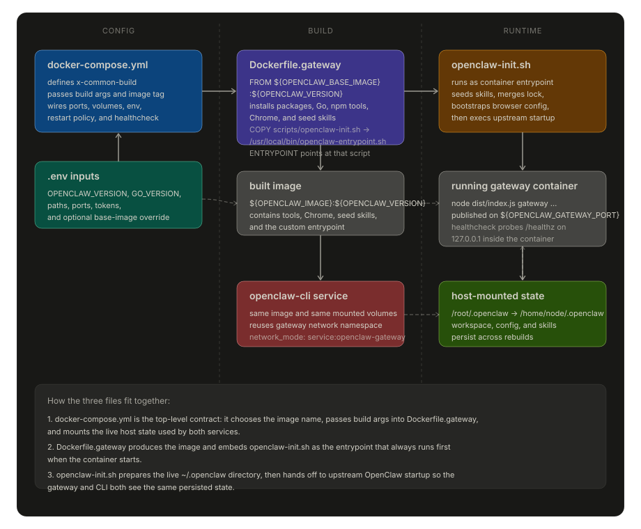

# openclaw-setup — Personal OpenClaw Gateway

This repository is a **production-ready personal setup** for running [OpenClaw](https://openclaw.ai/) as a self-hosted AI gateway inside Docker. It extends the official OpenClaw image with extra IT-admin tools, a Go toolchain, pinned ClawHub skills, and a clean Compose workflow — so your gateway is reproducible, self-documenting, and ready to use out of the box.

> **New to OpenClaw?**
> - **Start**: [Docs](https://docs.openclaw.ai/index.md) · [Getting started](https://docs.openclaw.ai/start/getting-started.md) · [Setup](https://docs.openclaw.ai/start/setup.md) · [Personal assistant setup](https://docs.openclaw.ai/start/openclaw.md)
> - **Install**: [Docker](https://docs.openclaw.ai/install/docker.md) · [Environment variables](https://docs.openclaw.ai/help/environment.md) · [Updating](https://docs.openclaw.ai/install/updating.md)
> - **Configure**: [Gateway runbook](https://docs.openclaw.ai/gateway/index.md) · [Configuration reference](https://docs.openclaw.ai/gateway/configuration-reference.md) · [Authentication](https://docs.openclaw.ai/gateway/authentication.md) · [Secrets](https://docs.openclaw.ai/gateway/secrets.md) · [Model providers](https://docs.openclaw.ai/providers/models.md)
> - **Extend**: [Skills](https://docs.openclaw.ai/tools/skills.md) · [ClawHub](https://docs.openclaw.ai/clawhub/index.md) · [Creating skills](https://docs.openclaw.ai/tools/creating-skills.md)
> - **Help**: [FAQ (first run)](https://docs.openclaw.ai/help/faq-first-run.md) · [Troubleshooting](https://docs.openclaw.ai/gateway/troubleshooting.md) · [GitHub repo](https://github.com/openclaw/openclaw)

---

## What is OpenClaw?

OpenClaw is a personal AI assistant you run on your own infrastructure. It connects to AI providers (OpenAI, Gemini, Anthropic, …) and delivers responses on the channels you already use — Telegram, Discord, WhatsApp, Slack, iMessage, and many more. The Gateway is the always-on control plane that keeps everything running.

This repository gives you a Dockerized gateway setup with extras baked in at image build time, so every container start is identical with no manual configuration inside the container.

---

## What this repo adds on top of the official image

| Added layer | What it provides |
|---|---|
| System packages (step 1) | Full IT-admin toolkit: networking (`nmap`, `iperf3`, `socat`, `tcpdump`, …), monitoring (`htop`, `glances`, `sysstat`, …), storage/TLS tools, `gh` CLI, Google Chrome, virtual display (`xvfb`), CalDAV clients (`vdirsyncer`, `khal`) |
| Python tools (step 2) | `uptime-kuma-api` (system Python) + Hoymiles cloud venv at `/opt/hoymiles-cloud/venv` (`aiohttp`, `argon2-cffi`) |
| Go toolchain + `hcloud` (step 3) | Go compiler at `/usr/local/go` + Hetzner Cloud CLI at `/usr/local/bin/hcloud` |
| Entrypoint + resolver (step 4) | `openclaw-init.sh` → `/usr/local/bin/openclaw-entrypoint.sh`, Vaultwarden resolver → `/usr/local/bin/openclaw-bw-resolver`; switches to `node` user (uid 1000) |
| Go environment (step 5) | Set `GOPATH`, `PATH`, and other Go-related env vars for the `node` user |
| Go tools (step 6) | `qcard` — a CardDAV CLI address book application; useful for contact management and email client integration (see [qcard docs](https://pkg.go.dev/ser1.net/qcard)) |
| Node.js tools (step 7) | `clawhub`, `xurl`, `summarize`, `qmd`, `browser-use` installed under `/home/node/.local`, plus bw CLI device-string patch and credential hardening |
| vault-fetch plugin (step 8) | Native `vault_fetch` agent tool for on-demand Vaultwarden credentials (built in-process) |
| HEALTHCHECK | Built-in Docker healthcheck polling `/healthz` |
| OCI labels | `org.opencontainers.image.title` + `version` for `docker inspect` and image scanners |

**Golden rule**: system dependencies are configured at Docker **build time**. Running `apt-get`, `npm install -g`, or `python -m pip install` inside a running container is an anti-pattern here — it will be lost on restart. Skills are the one runtime exception: install them against the live volume with `scripts/install-skills.sh` (see [Skills](#skills)).

---

## Prerequisites

- Docker Engine (or Docker Desktop) + Docker Compose v2
- At least **15 GB** free disk space (the extended image is ~2.5 GB larger than the official base)
- A `.env` file copied from `.env.example` and filled with your secrets

---

## Quick start

```bash
# 1. Clone this repo
git clone https://github.com/henningsieh/openclaw-setup.git /root/openclaw
cd /root/openclaw

# 2. Copy the env template and fill in your secrets
cp .env.example .env
$EDITOR .env    # set OPENCLAW_GATEWAY_TOKEN, API keys, etc.

# 3. Build the gateway image (first build takes ~5-10 min)
docker compose build openclaw-gateway

# 4. Start the gateway
docker compose up -d openclaw-gateway

# 5. Wait ~20s, then check health
curl http://localhost:18789/healthz
# → {"ok":true,"status":"live"}

# 6. Open the Control UI
open http://localhost:18789
```

The gateway runs as user `node` (uid 1000). All persistent state lives on the host at `OPENCLAW_CONFIG_DIR` and survives container rebuilds. This deployment uses `/home/shelldon/.openclaw` (owned by system user `shelldon` at uid/gid 1000:1000) so that direct SSH access to the config tree is permission-free. The default for a root-only setup would be `/root/.openclaw`.

---

## Repository layout

```
/root/openclaw/                  ← this repository
  Dockerfile.gateway             ← extends the official image with extra tools + skills
  docker-compose.yml             ← gateway + CLI services
  .env.example                   ← template — copy to .env and fill in secrets
  .env                           ← your local secrets (gitignored, never commit)
  AGENTS.md                      ← machine-oriented guide for AI agents
  README.md                      ← this file
  scripts/
    openclaw-init.sh             ← container entrypoint: prepares config/browser/creds, starts gateway
    vaultwarden/
      openclaw-bw-resolver.mjs   ← Vaultwarden exec SecretRef protocol handler (low-level)
      README.md                  ← Vaultwarden integration architecture
  plugins/
    vault-fetch/                 ← OpenClaw tool plugin exposing the vault_fetch agent tool
  assets/
    openclaw_build_flow.svg      ← build flow diagram
    openclaw_skills_loading.svg  ← skill loading flow diagram

/root/openclaw-src/              ← upstream source clone (only needed for PR builds)
```

Images live only in the **local Docker image store** — they are never pushed to a registry. Run `docker images | grep openclaw` to list them.

---

## File map

| File | Role |
|---|---|
| `Dockerfile.gateway` | Steps 0–8: base → packages → Python tools → Go/hcloud → entrypoint → Go env → tools → vault-fetch plugin |
| `docker-compose.yml` | Two services: `openclaw-gateway` (long-lived) + `openclaw-cli` (profile: `cli`) |
| `scripts/openclaw-init.sh` | Container entrypoint: prepares live config, browser defaults, bw/gh/qcard credentials, starts gateway |
| `scripts/vaultwarden/` | Vaultwarden credential integration docs and helper scripts — see [README](scripts/vaultwarden/README.md). This is repo/container documentation, not an OpenClaw skill manifest. |
| `.env` | Your secrets and path overrides — **gitignored, never commit** |
| `.env.example` | Template with all keys documented — commit-safe |
| `AGENTS.md` | Machine-oriented guide for AI agents working in this repo |

---

## How These Files Work Together

The build and runtime flow is controlled by three files working as a chain:

- `docker-compose.yml` is the top-level orchestrator. It chooses the image name, passes build arguments into the Docker build, mounts the persistent host directories, publishes the gateway port, and defines both the long-lived gateway service and the one-shot CLI sidecar.
- `Dockerfile.gateway` turns those build arguments into an actual image. It installs system packages, Python tools, Go, npm tools, Chrome, and the `vault-fetch` plugin, then copies `openclaw-init.sh` into the image and makes it the container entrypoint.
- `openclaw-init.sh` is the first code that runs when the container starts. It prepares the live `~/.openclaw` directory, bootstraps browser defaults (Chrome via Xvfb), pre-warms the bw CLI cache, persists `gh` auth, provisions CardDAV/CalDAV credentials (qcard/vdirsyncer/khal) from Vaultwarden, and only then hands off to the upstream OpenClaw startup path.

<!-- Build flow diagram: compose -> Dockerfile -> entrypoint -> runtime -->


This is the control flow in one sentence: `docker compose` reads `.env`, builds `Dockerfile.gateway`, that image bakes in `openclaw-init.sh`, and the running container uses that entrypoint to prepare the mounted host state before starting the gateway.

---

## Skills

OpenClaw skills are prompt/tool bundles installed under `~/.openclaw/skills/` (host: `OPENCLAW_CONFIG_DIR/skills`). This repo installs pinned ClawHub skills **at runtime** into the live host volume via `scripts/install-skills.sh` — nothing skill-related is baked into the image. Because the skills live on the persisted volume, they survive container restarts and image rebuilds automatically.

### How skill installation works

`scripts/install-skills.sh` is an idempotent installer: run it once after `docker compose up -d openclaw-gateway`, and again whenever a `CLAWHUB_*_SKILL_VERSION` changes in `.env`. It waits for the gateway health endpoint, then for each pinned skill runs:

```bash
docker compose run --rm --no-deps --entrypoint node openclaw-gateway \
  dist/index.js skills install @owner/slug --version <version> --global --force
```

- `--global` installs into the shared managed skills directory (`/home/node/.openclaw/skills` inside the container, i.e. `OPENCLAW_CONFIG_DIR/skills` on the host).
- Re-running the same pinned version is effectively a no-op.
- No Dockerfile change and no image rebuild are required when skills change.

**Key insight**: OpenClaw scans `~/.openclaw/skills/` automatically at startup. Skills installed this way persist across restarts and rebuilds — they only disappear if the host volume is wiped.

### Installed skills

| Skill | Version pin | Purpose |
|---|---|---|
| `github` | `1.0.0` | GitHub integration — search issues, create PRs, review code |
| `browser-use` | `2.0.1` | Browser automation via Python agent |
| `agent-browser-clawdbot` | `0.1.0` | ClawdBot browser agent |
| `caldav-calendar` | `1.0.1` | CalDAV calendar integration (SOGo) |

### Adding or removing skills

Edit the `SKILLS` array in `scripts/install-skills.sh`:

```bash
SKILLS=(
  "@steipete/github:CLAWHUB_GITHUB_SKILL_VERSION"
  "@shawnpana/browser-use:CLAWHUB_BROWSER_USE_SKILL_VERSION"
  "@matrixy/agent-browser-clawdbot:CLAWHUB_AGENT_BROWSER_SKILL_VERSION"
  "@asleep123/caldav-calendar:CLAWHUB_CALDAV_CALENDAR_SKILL_VERSION"
  # add new "@owner/slug:VAR_NAME" lines here
)
```

Then run `scripts/install-skills.sh` again to apply. To uninstall, use `docker exec openclaw-openclaw-gateway-1 node dist/index.js skills uninstall @owner/slug --yes` and remove the entry from `SKILLS`.

### Verify installed skills

```bash
docker exec openclaw-openclaw-gateway-1 node dist/index.js skills list
# github  1.0.0
# browser-use  2.0.1
# agent-browser-clawdbot  0.1.0
# caldav-calendar  1.0.1
```

---

## Configuration — `.env` reference

Copy `.env.example` to `.env` and fill in your values. The file is gitignored and must never be committed.

### Build / image versions

| Variable | Example | Purpose |
|---|---|---|
| `OPENCLAW_VERSION` | `2026.7.1` | Image tag for base + gateway images |
| `GO_VERSION` | `1.26.3` | Go toolchain version installed in the image |
| `OPENCLAW_IMAGE` | `openclaw-local` | Local tag for the built gateway image |
| `OPENCLAW_BASE_IMAGE` | `ghcr.io/openclaw/openclaw` | Base image to extend (see [Base image](#base-image)) |
| `COMPOSE_BAKE` | `1` | Compose-only: delegate builds to BuildKit bake (not a Dockerfile arg) |
| `QCARD_VERSION` | `latest` | `qcard` Go tool version (resolved at build time) |
| `CLAWHUB_CLI_VERSION` | `latest` | `clawhub` npm package version |
| `BROWSER_USE_CLI_VERSION` | `latest` | `browser-use` CLI package version |
| `AIOHTTP_VERSION` | `3.14.3` | `aiohttp` pin in the Hoymiles venv (Dockerfile step 2) |
| `ARGON2_VERSION` | `25.1.0` | `argon2-cffi` pin in the Hoymiles venv (Dockerfile step 2) |
| `CLAWHUB_GITHUB_SKILL_VERSION` | `1.0.0` | `github` skill version |
| `CLAWHUB_BROWSER_USE_SKILL_VERSION` | `2.0.1` | `browser-use` skill version |
| `CLAWHUB_AGENT_BROWSER_SKILL_VERSION` | `0.1.0` | `agent-browser-clawdbot` skill version |
| `CLAWHUB_CALDAV_CALENDAR_SKILL_VERSION` | `1.0.1` | `caldav-calendar` skill version |

### Runtime flags

| Variable | Default | Purpose |
|---|---|---|
| `OPENCLAW_NO_RESPAWN` | `1` | Disable internal respawn (Docker handles restarts) |
| `OPENCLAW_GATEWAY_BIND` | `lan` | `lan` = reachable from host; `loopback` = container-only |
| `OPENCLAW_GATEWAY_PORT` | `18789` | Published gateway port |
| `OPENCLAW_DISABLE_BONJOUR` | `1` | Disable mDNS (Docker bridge doesn't forward multicast) |

### Host paths (used by Compose bind mounts)

| Variable | Default | Purpose |
|---|---|---|
| `OPENCLAW_CONFIG_DIR` | `/home/shelldon/.openclaw` ¹ | Host path → `/home/node/.openclaw` |
| `OPENCLAW_WORKSPACE_DIR` | `/home/shelldon/.openclaw/workspace` ¹ | Host path → `/home/node/.openclaw/workspace` |
| `OPENCLAW_BACKUP_DIR` | `/mnt/openclaw-backup` | Host path → `/mnt/nextcloud/Backups` (backup share) |
| `NEXTCLOUD_DOCUMENTS_DIR` | `/mnt/nextcloud/Documents` | Host path → `/mnt/nextcloud/Documents` (read-only bind) |
| `NODE_COMPILE_CACHE` | `/var/tmp/openclaw-compile-cache` | V8 compile cache root; compose appends `${OPENCLAW_VERSION}` |
| `OPENCLAW_TRUSTED_PROXIES` | `172.25.0.1` | Trusted proxy for the gateway (docker bridge) |

> ¹ **Non-default path.** This deployment places the config tree under `/home/shelldon/` rather than `/root/`. The system user `shelldon` has uid/gid `1000:1000`, matching the container's `node` user. This means all files in the config dir are owned by `shelldon`, not root — so you can SSH in as `shelldon` and browse or edit the config without permission issues. If you run on a root-only server, change both paths back to `/root/.openclaw[/workspace]`.

### Container-internal paths

| Variable | Default | Purpose |
|---|---|---|
| `OPENCLAW_DIR` | `/home/node/.openclaw` | Live config dir inside the container |
| `OPENCLAW_BUNDLED_PLUGINS_DIR` | `/app/dist/extensions` | Image-bundled plugins dir |
| `XDG_CONFIG_HOME` | `/home/node/.config` | XDG config override inside container |

### Secrets

| Variable | Purpose |
|---|---|
| `OPENCLAW_GATEWAY_TOKEN` | Bearer token for gateway API auth — generate with `openssl rand -hex 32` |
| `GATEWAY_AUTH_PASSWORD` | Web UI password |

### API keys

`GITHUB_TOKEN`, `COPILOT_GITHUB_TOKEN`, `GEMINI_API_KEY`, `OPENROUTER_API_KEY`, `NVIDIA_API_KEY`, `OPENCODE_API_KEY`, `TELEGRAM_BOT_TOKEN`, `DISCORD_BOT_TOKEN`, `HCLOUD_TOKEN`, `COOLIFY_API_TOKEN`, `GROCY_API_KEY`

### Service-specific variables

| Variable | Value | Purpose |
|---|---|---|
| `SOGO_EMAIL` | `henning@sieh.org` | SOGo/MailCow account used for CardDAV/CalDAV provisioning |
| `HOYMILES_PLANT_ID` | `14557760` | Hoymiles S-Miles plant ID (credentials fetched via `vault_fetch`) |

### Vaultwarden runtime boundary

This setup keeps the original runtime Vaultwarden model:

- `BW_SERVER_URL` (`https://vault.apps.sieh.org`), `BW_CLIENTID`, `BW_CLIENTSECRET`, and `BW_PASSWORD` are provided to the running container
- `openclaw-bw-resolver` uses them to log in with `bw --apikey` and unlock the vault at runtime
- OpenClaw SecretRefs still resolve into the gateway's in-memory snapshot after activation/reload

Important warning:

- this is a convenience/runtime integration, **not** a hard process-isolation boundary
- if a plaintext secret is available to the long-lived gateway/container process, treat it as potentially recoverable by code running in that same environment
- keep the host and container private; do not treat this setup as protection against a fully capable local agent with same-process or same-user access

---

## Day-to-day operations

### Start / stop / restart

```bash
docker compose up -d openclaw-gateway       # start in background
docker compose stop openclaw-gateway        # stop
docker compose restart openclaw-gateway     # restart
docker compose logs -f openclaw-gateway     # follow logs
```

### Health check

```bash
curl -sf http://localhost:18789/healthz
# → {"ok":true,"status":"live"}

docker compose ps openclaw-gateway          # shows "healthy" once ready
```

### Run a CLI command

The `openclaw-cli` service shares the gateway's network namespace and is available as a one-shot CLI container:

```bash
docker compose run --rm openclaw-cli channels list
docker compose run --rm openclaw-cli devices list
docker compose run --rm openclaw-cli config get gateway.bind
```

### Quick rebuild (entrypoint or skill changes only)

Steps 4+ re-run; everything before the `COPY` is cached:

```bash
docker compose up -d --build --force-recreate --no-deps openclaw-gateway
```

### Full rebuild (system package or tool version change)

```bash
docker compose up -d --build --force-recreate --no-deps openclaw-gateway
```

### Updating to a new OpenClaw release

1. Update `OPENCLAW_VERSION` (and `GO_VERSION` if a newer Go ships with the release) in `.env`.
2. Rebuild:

```bash
docker compose up -d --build --force-recreate --no-deps openclaw-gateway
```

---

## Base image

The `OPENCLAW_BASE_IMAGE` variable in `.env` controls which base image `Dockerfile.gateway` builds on top of:

| Value | Effect |
|---|---|
| `ghcr.io/openclaw/openclaw` *(default)* | Official release pulled from GitHub Container Registry |
| `openclaw-patched` | Locally-built image with a custom PR or branch merged in |

---

## Building a gateway image from an upstream PR

Use this when you want to test an unmerged upstream fix or feature before it ships in an official release.

### Step 1 — Clone / update the upstream source

```bash
# First time only:
git clone https://github.com/openclaw/openclaw.git /root/openclaw-src
cd /root/openclaw-src

# Add the remote that contains the PR branch (one-time per fork):
git remote add <fork-author> https://github.com/<fork-author>/openclaw.git
```

### Step 2 — Check out the PR branch

```bash
cd /root/openclaw-src
git fetch <fork-author>
git checkout <fork-author>/<pr-branch-name>
```

Alternative — fetch by PR number:

```bash
git fetch origin pull/<pr-number>/head:pr-<pr-number>
git checkout pr-<pr-number>
```

### Step 3 — Free disk space

The source build produces a ~3 GB image. Clear build cache first:

```bash
docker builder prune -af
docker image prune -f
df -h /     # confirm at least ~15 GB free
```

### Step 4 — Build the patched base image

```bash
cd /root/openclaw-src
docker build --no-cache \
  --build-arg OPENCLAW_DOCKER_APT_UPGRADE=0 \
  -t openclaw-patched:${OPENCLAW_VERSION} \
  .
```

`OPENCLAW_DOCKER_APT_UPGRADE=0` skips `apt-get upgrade` to save ~5 min (optional but recommended). Build takes roughly **10 minutes**.

Validate the expected change is present:

```bash
# Check that a file from the PR exists:
docker run --rm openclaw-patched:${OPENCLAW_VERSION} ls /app/dist/<path>

# Check that a binary is available:
docker run --rm openclaw-patched:${OPENCLAW_VERSION} command -v <binary>

# Run a focused CLI check:
docker run --rm openclaw-patched:${OPENCLAW_VERSION} node dist/index.js --help
```

### Step 5 — Build the gateway image on top of the patched base

In `.env`, set:

```dotenv
OPENCLAW_BASE_IMAGE=openclaw-patched
```

Then build:

```bash
cd /root/openclaw
docker compose up -d --build --force-recreate --no-deps openclaw-gateway
```

### Step 6 — Restart and validate

```bash
docker compose up -d openclaw-gateway

# Wait ~20s, then:
curl http://localhost:18789/healthz
# → {"ok":true,"status":"live"}
```

### Switching back to the official release

Remove or comment out `OPENCLAW_BASE_IMAGE` in `.env`, then rebuild:

```bash
docker compose up -d --build --force-recreate --no-deps openclaw-gateway
```

### Applying a different or newer PR

Repeat Steps 1–6. Keep multiple patched images side-by-side with different tags:

```bash
docker build --no-cache -t openclaw-patched-pr99999:${OPENCLAW_VERSION} .
# Then in .env: OPENCLAW_BASE_IMAGE=openclaw-patched-pr99999
```

---

## Image size breakdown

The gateway image is noticeably larger than the official base because of what this repo adds. Measured with `docker history`:

| Layer | Size | What it adds |
|---|---|---|
| `apt-get install` (packages + gh + Chrome) | **~966 MB** | Expanded IT-admin toolkit, CalDAV clients, virtual display, Chrome |
| Go toolchain + `hcloud` | **~251 MB** | Entire Go stdlib, compiler, and tools under `/usr/local/go` + Hetzner CLI |
| Python tools (uptime-kuma-api + Hoymiles venv) | **~5 MB** | System `pip3` package + `/opt/hoymiles-cloud/venv` (`aiohttp`, `argon2-cffi`) |
| `go install qcard` | **~107 MB** | Compiled binary + Go module download cache in `$GOPATH/pkg/mod` |
| `npm install -g clawhub xurl summarize qmd @bitwarden/cli browser-use` | **~2.3 GB** | npm packages + full transitive deps (`clawhub` alone is large) |
| bw device-string patch + PATH removal | **~7.4 MB** | Two small layers editing/moving the bw binary |
| host-env-security `BW_*` patch | **< 1 MB** | `sed` patch of the bundled exec env-stripping policy |
| vault-fetch plugin (COPY + build) | **~415 MB** | Plugin sources + `node_modules` + compiled `dist/` |
| **Total image** | **5.24 GB** | `openclaw-local:2026.7.1` (`docker images`) |

> **Why the npm layer is so large** — `npm install -g` runs as a single `RUN`, so Docker stores the entire post-install delta as one opaque layer (2.31 GB on the current build). `npm cache clean --force` at the end doesn't help because Docker captures the layer *after* cleaning.
>
> **Why the Go module cache is not cleaned** — `go install` leaves source downloads in `$GOPATH/pkg/mod`. Adding `&& rm -rf /home/node/go/pkg/mod` to step 6 would recover ~100 MB.
>
> **Why the plugin layer is large** — step 8 copies the plugin (325 MB, dev deps incl. TypeScript) before `npm prune --production`; the COPY layer is retained even though the final image only needs typebox.
>
> Sizes above were measured with `docker history openclaw-local:2026.7.1` and change with the pinned versions in `.env`.

Inspect layers yourself:

```bash
docker history openclaw-local:<tag> --format "table {{.CreatedBy}}\t{{.Size}}"
```

---

## Image inventory

| Image | Role |
|---|---|
| `ghcr.io/openclaw/openclaw:<version>` | Official upstream base image |
| `openclaw-patched:<version>` | Locally built base with a PR branch merged in |
| `openclaw-local:<version>` | Your final gateway image built by this repo |

Images live only in the local Docker store. Save/restore for transfer or backup:

```bash
docker save openclaw-local:${OPENCLAW_VERSION} | gzip > openclaw-local-${OPENCLAW_VERSION}.tar.gz
# Restore on another host:
docker load < openclaw-local-${OPENCLAW_VERSION}.tar.gz
```

---

## Agent instructions

See [AGENTS.md](AGENTS.md) for machine-oriented guidelines covering the build architecture, skill seeding, environment variables, volume layout, and common mistakes to avoid.
